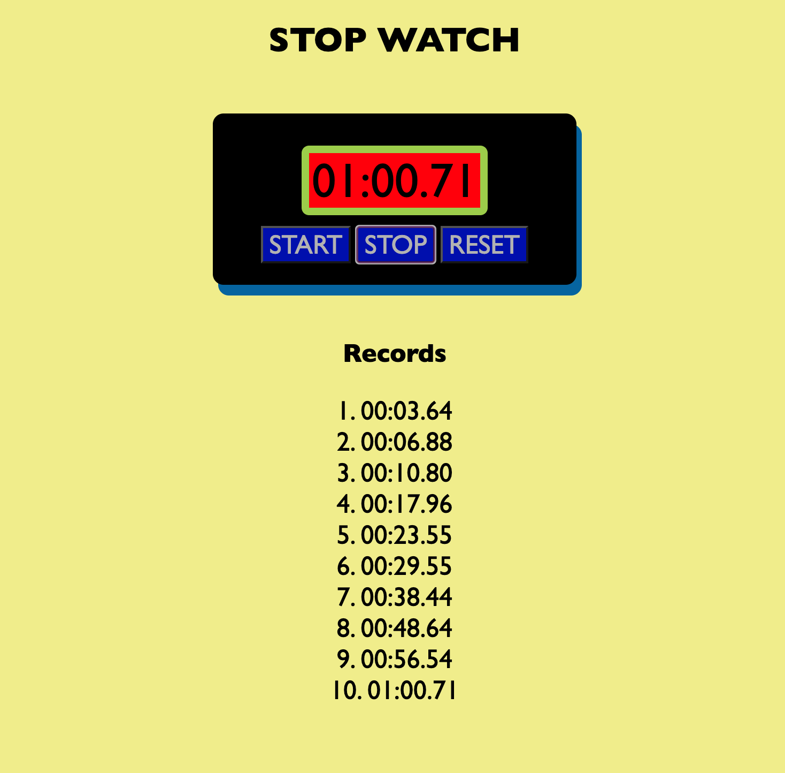

# Stopwatch in JS

## Background

An activity to make "Stopwatch" in MDN Web Docs "Cooperative asychronous JS: Timeouts and intervals".

## Improvements

- Display minutes, seconds, and one-hundreth of a seconds
- Display "Records" to record times when "Stop" button clicked

## Credits

- MDN Web Docs "Cooperative asychronous JS: Timeouts and intervals": https://developer.mozilla.org/ko/docs/Learn/JavaScript/Asynchronous/Timeouts_and_intervals

- MDN Web Docs Github: https://github.com/mdn/learning-area/blob/master/javascript/asynchronous/loops-and-intervals/setinterval-stopwatch.html